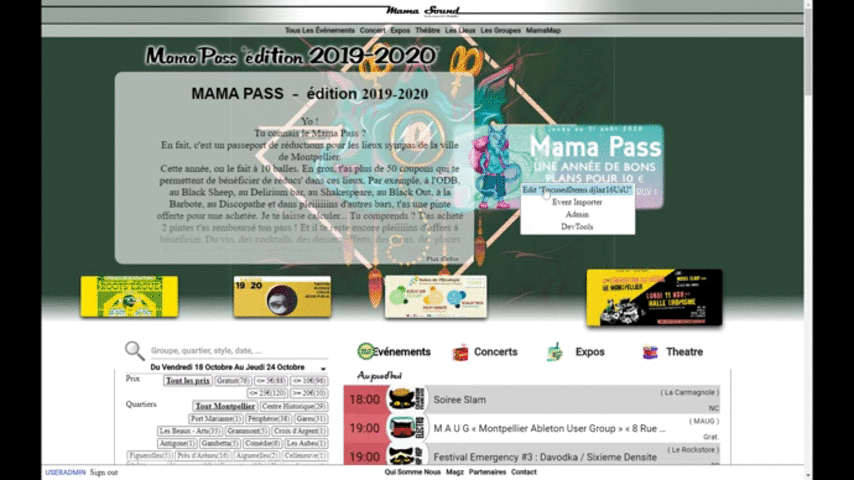

<h1 align="center">work in progress next mamasound.fr website</h1>
<p align="center">React SPA & CMS, with live edit, full SSR, including slideables, async data & metas</p>

tmp url : http://mamasound.wiseways.me/

_* this is personal project using experimental libs & wip design<br/>
_* this is NOT corporate grade code _

<p align="center"></p>


## How to start

### using docker-compose

```
npm run docker_start
```

& start browser at mamasound.localhost

Production docker ( auto built @ [n8tz/www.mamasound.fr:latest](https://cloud.docker.com/u/n8tz/repository/docker/n8tz/www.mamasound.fr) ) is [here](dockers/preprod) <br/>
Production docker-compose is [here](dockers/prod) 

### using local setup

#### setup
```
npm i
```

#### dev
```
npm run start-dev
npm run runBrowser
```

#### prod
```
npm run build
npm run start
```

## Code structure

This app inherit the base boilerplate & webpack config from [wi-layer-react-express](https://github.com/n8tz/wi-layer-react-express)

See [webpack-inherit](https://github.com/n8tz/webpack-inherit)

## License 

Not free
